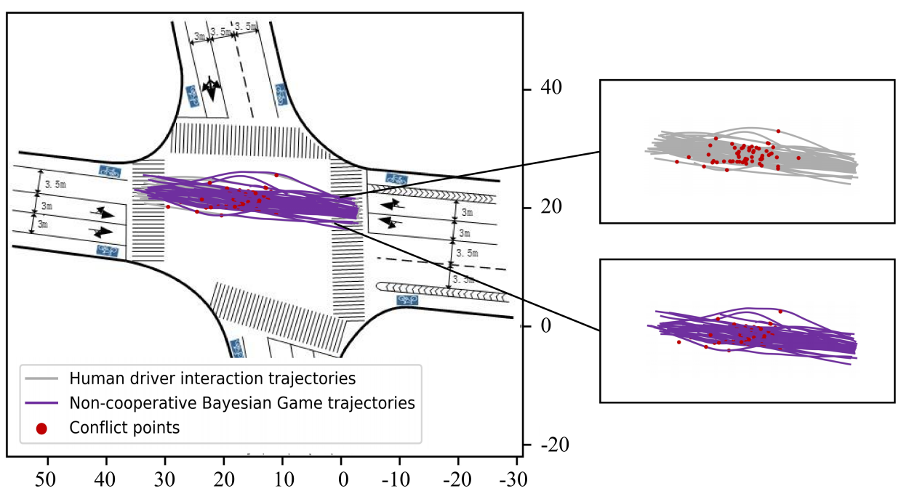
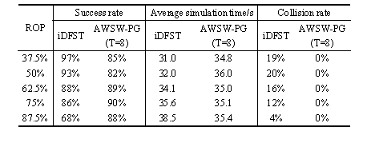
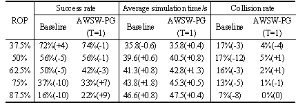

# A Potential Game-based Framework for Cooperative Driving at Mixed Un-signalized Intersections

**[Shiyu Fang](https://tops.tongji.edu.cn/info/1033/1190.htm)**, [Peng Hang](https://tops.tongji.edu.cn/info/1031/1383.htm), [Jian Sun](https://tops.tongji.edu.cn/info/1031/1187.htm)  

[Department of Traffic Engineering and Key Laboratory of Road and Traffic Engineering, Ministry of Education, Tongji University](https://tops.tongji.edu.cn/)  

## Abstract

Connected Autonomous Vehicles (CAVs) technology is believed to enhance traffic efficiency and safety significantly. However, numerous accidents have demonstrated that the decision-making algorithm of CAV under highly complex environments has limitations, especially at mixed intersections. Considering the increased hazards posed by heterogeneous Human Driven Vehicles (HDVs) in real-world traffic, an Adaptive Weight Shapley Weighted Potential Game (AWSW-PG) is proposed to establish a cooperative driving framework for CAVs. Heterogeneous HDVs are modeled by a non-cooperative Bayesian game and utilized as background traffic. Then, the potential game that connects the individual reward and cluster reward generates the optimal cooperative solution by searching the Nash Equilibrium of the problem. Furthermore, the Shapley value is introduced to quantify the unsymmetrical impact of each vehicle. Finally, given the uncontrollable and unpredictable nature of HDVs, an adaptive weight method is formalized to adjust the estimation on HDVs dynamically. To evaluate the effectiveness and robustness of the proposed cooperative driving framework, three cases are conducted. Results demonstrate that the AWSW-PG framework exhibits good performance in terms of efficiency and safety under different rates of penetration. In addition, the quantification of vehicle impacts and dynamic adjustment of HDVs estimates have been proven capable of guaranteeing stability and efficiency during cooperation.

## Method Overview

Firstly, based on our previous study, we formulate a non-cooperative Bayesian game to reproduce the heterogeneous HDVs decisions. Secondly, the individual reward and potential reward (cluster reward) are linked through Potential Games (PGs). Through rigorous derivation, we further demonstrate the uniqueness and global optimality of NE in PG. Then, the Shapley value is introduced to quantify the unsymmetrical impacts of vehicles. Finally, an adaptive weight method is proposed to dynamically correct the discrepancies between HDVs' real action and predicted action.  


## Experiments
Multiple experiments are conducted, including an ablation experiment on the Shapley value in a purely CAV environment, a comparison of efficiency and safety under different Rates of Penetration (ROP), and the significance test after heterogeneous HDVs involved. Here we focus on a supplementary explanation of the results of the study and present them in a more intuitive manner (especially via .MP4). For further knowledge acquisition, please refer to [arXiv]().


### Ablation experiment on the Shapley value
In order to facilitate the reader to understand how Shapley value is constantly changing in the process of cooperation, we use the shade of color to represent the value of the Shapley value. More specifically, the closer the color of the vehicle is to purple, the higher its Shapley value is at this moment. This indicates that the vehicle currently has a greater impact on the system. Conversely, lighter colors indicate weaker impacts on the system. Additionally, each car's normalized Shapley value is displayed next to it. The cooperation case shown in Fig.5 in the paper is shown below  

<div align=center>
| <video muted controls width=380> <source src="./src/ablation-case.mp4"  type="video/mp4"> </video> |
</div>


### Comparison under different ROP
In this subsection, we compare the baseline and AWSW-PG(T=1) from an aggregate point of view at first. The results indicate that the implementation of the adaptive weight method provides efficient improvement for collision avoidance. A specific case comparison is shown below  

| <video muted controls width=380> <source src="./src/baseline-case1.mp4"  type="video/mp4"> </video> <video muted controls width=380> <source src="./src/AWSW-PG(T=1)-case1.mp4"  type="video/mp4"> </video> |

As observed in the video, collisions occur when CAVs are driven by the baseline model due to their inability to correct HDV estimates in real time. However, we acknowledge that driving is a sequential decision-making process, and selecting an appropriate planning time can effectively prevent shortsighted behavior. Moreover, in our paper, we mention that though the adaptive weight method successfully helps CAVs avoid collision, it sacrifices efficiency and causes deadlocks.

Thus, we have extended the planning horizon to 8 steps. Additionally, we also present a case to visualize this improvement 

| <video muted controls width=380> <source src="./src/AWSW-PG(T=1)-case2.mp4"  type="video/mp4"> </video> <video muted controls width=380> <source src="./src/AWSW-PG(T=8)-case2.mp4"  type="video/mp4"> </video> |

### Experiments with heterogeneous HDVs involved
Considering that CAVs will continually mix with HDVs that possess various driving abilities, and styles in a long time. we further investigate our model by introducing heterogeneous human-driven vehicles into the background traffic. Specifically, we use orange, blue, and green to represent aggressive, neutral, and conservative drivers respectively (unknown information for connected autonomous vehicles). The transparency of colors indicates the discrepancy between actual actions and predicted actions. When the discrepancy between actual and predicted actions is relatively minor, HDV will be marked with a √ symbol.


| <video muted controls width=380> <source src="./src/h-hdvs-case1.mp4"  type="video/mp4"> </video> <video muted controls width=380> <source src="./src/h-hdvs-case2.mp4"  type="video/mp4"> </video> |


## Citation
```
@misc{,
      title={}, 
      author={},
      year={2023},
      eprint={},
      archivePrefix={arXiv},
      primaryClass={cs.MA}
}
```

## Appendix

### 1.Modeling Heterogeneous HDV
Despite the uncertainty due to the absence of traffic lights, unpredictable and uncontrollable HV latent intention of decision may lead to even greater strait for CAVs. In order to validate the cooperative driving algorithm of CAVs in heterogeneous mixed traffic. In this section, sophisticated real-world drivers' demonstrations were extracted for reproducing heterogeneous HV decisions. 

The main process consists of four steps. Firstly, interaction data from a real-world intersection were collected. Secondly, drivers' decisions were classified into three groups by K-means cluster. Then, non-cooperative game, known as a promising model to reproduce the process of human decision making, was selected to guide the generation of HVs' decision. Finally, the decision-making preference of each group was calibrated through IRL. 

#### Drivers' Decisions Classification by K-means Cluster
In order to reproduce drivers with different decision-making preferences. The first priority was to determine how many decision clusters the drivers at the intersection of XXJH can be divided into. Based on the result of the elbow method, a simple but versatile theory to determine the number of clusters using the Sum of Squared Errors (SSE), three clusters work best for our data. Considering that speed and acceleration are the most intuitive manifestation of decision making during driving, the average, maximum, minimum, and standard deviation of speed and acceleration of vehicles were taken as the clustering parameters}. K-means clustering was then used to classify naturalistic human driving data samples in XXJH.

After the clustering algorithm converged, the drivers' decisions in XXJH were divided into three clusters: normal, conservative, and aggressive. Furthermore, their trajectories were used as expert demonstrations and then compared with HDVs' feasible trajectories to calibrate different decision-making preferences. In this paper, a non-cooperative game was chosen to estimate possible decisions human may adopt when confronted with other drivers because it achieves more realistic human behavior when performing conflicting maneuvers at intersections. Together with vehicle dynamics, feasible trajectories of each frame can be concluded.

#### HDVs' Feasible Trajectories Generation through Non-cooperative Game
As mentioned before, game theory describes human as a rational decision-maker who takes action dependencies into account. Hence, there is a growing application in the field of modeling human decision. In this paper, we regard human drivers as rational decision-makers and are aware of the consequence that their actions will influence other drivers who have conflict with them in temporal and spatial dimensions. Non-cooperative game was therefore established to mimic how drivers conjecture and compete with each other while driving in sharing space. We considered a sampling interval, $\Delta t=0.1s$, and an action set including six strategies that represent common driving maneuvers in urban traffic is listed below. 

Table. Action set


#### Decision-making Preference Calibration by IRL
After dividing drivers into groups and generating feasible trajectories through non-cooperative game. IRL was introduced to excavate inherent characteristics that influence the expert decision. IRL was proposed later than behavior cloning. Though they share many similarities. Differing from simply imitating expert maneuvers, IRL tries to infer the reason why experts make their decision and then optimize the strategy. In other words, except directly learning the state-action mapping, IRL infers the form of reward weight and optimizes maneuvers through it. The pseudocode of maximum entropy IRL is summarized in Algorithm.1.


After training, the reward weights of different driver groups can be calibrated through maximizing entropy and iterating, as shown below.

Table. IRL Calibration Results


As in Table, the aggressive driver group possessed the highest efficiency value, and lowest safety and comfort value, indicating their preference for passing at a high speed and more willingness to detour rather than stop and wait. Meanwhile, conservative drivers were more concerned about driving comfort and safety, leading to conservative decisions. The reward weights of normal drivers were in the middle range, these drivers do not have an over preference and try to balance efficiency, comfort, and safety while driving. 

#### Experiments to assess the effectiveness of non-cooperative Bayesian game
In order to verify whether the non-cooperative Bayesian game can effectively reproduce the behavior of the human driver, we adopt the replay test method. Specifically, the subject vehicle utilizes a game theory framework consisting of six discrete strategies including turning, accelerating and decelerating for decision-making, while the interactive vehicles replays collected trajectories accordingly. 

First of all, we can see from the result, in 92% of cases, the simulation results are the same as the original data, that is, the sequence of conflict points does not change. Secondly, we also visualized the reproduced results in Figure, where the gray lines represent human drivers' interaction trajectories from the original data, and the blue lines represent the trajectories generated using the proposed non-cooperative Bayesian game. It can be readily discerned that our proposed game-based method can effectively reproduces diverse human driver trajectories.



### 2.Comparison with reservation-based method
The reservation-based approach is well known for its clear principles and safety guarantees. The reservation-based system consists of an intersection manager and vehicle agents. Each approaching vehicle agent sends a request to the intersection manager to reserve certain space-time within the intersection in its desired path. In reservation-based approach, the service sequence of the vehicles is determined under simple but effective policies such as first come first served (FCFS) strategy, auction strategy, and BATCH strategy. However, the reservation-based approach often relies on deploying all vehicle agents under the control of a coordinator. In real-world mixed driving environments where HDVs are uncontrolled, this can lead to sub-optimal performance of the reservation-based approach. Therefore, we further compare the improved Depth First Search Tree (iDFST) method, a bulk right-of-way allocation approach combining vehicle conflict topology and tree search, with the potential game proposed in this manuscript (ASWS-PG(T=8)). The performance of two models are summarized as below.

Table. Model performance comparison between iDFST and Potential game



According to Table, the iDFST approach fails to effectively avoid collisions for each permeability. This can be attributed to the fact that in our studied mixed environment, HDVs are not connected vehicles and possess their own decision logic, thus disregarding commands from the coordinator like CAVs. To address this issue, we propose a cooperative framework that combines adaptive methods and game theory. This framework successfully identifies heterogeneous drivers within the environment and devises targeted adjustment strategies to prevent collisions. In addition, in comparison with the proposed method, the success rate and average simulation time exhibit relatively consistent performance across different permeability levels. However, as the permeability increases, the efficiency of the cooperative system controlled by iDFST approach noticeably declines. This phenomenon can be attributed to an increasing number of agents responding to the coordinator's control, resulting in a significant increase in tree depth (passing order). Given that the iDFST approach was designed to restrict entry into the intersection to right-of-way vehicles only, resulting in an increase in travel time.

In conclusion, the current reservation-based approach is difficult to extend directly to the mixed driving environment. At the same time, our research focuses on the motion planning layer of autonomous driving, and ensuring safety and convergence in a highly uncertain environment necessitates coordinated works from multiple layers. Currently, our algorithm has only been validated in a simulation environment; however, we aim to further validate it through multidimensional approaches such as hardware-in-the-loop and driver-in-the-loop testing in future. 

### 3.Performance changes after introducing comfort
Typically, there are two predominant approaches: incorporating jerk into the overall reward as a comfort penalty or constraining deceleration within a specific range, known as comfort deceleration. Given that the decision variable of the proposed cooperative framework is acceleration, we have opted for the latter approach. Specifically, we have designed lower limits of acceleration at -4m/s2 which aligns with commonly utilized values in many car-following models and simulation settings. Meanwhile, considering the reviewer's suggestion, we also include comfort as part of the overall reward. Specifically, comfort is characterized by jerk. 

After introducing comfort into the overall reward, the regularities observed in Section 6.3 remain. Therefore, we have only updated the corresponding tables and figures in the revised manuscript. However, through a comparative analysis of the indicators before and after the introduction of comfort, small changes can be found.

Here, we would like to point out the reasons driving these changes in order to enhance reviewers' comprehension of how the integration of comfort has impacted our model. 

Table. Changes after introducing comfort



Table exhibits the changes after introducing comfort into our overall reward. According to the Table, it is not difficult to find that the collision rate decreases under basically each permeability after introducing comfort, especially the baseline method. We posit that this phenomenon can be attributed to the discomfort caused by abrupt changes in CAV acceleration. Therefore, rapid acceleration or rapid deceleration behavior is eliminated, thereby enhancing the comprehensibility of CAV action and ultimately improving safety levels. At the same time, we found that the efficiency of the system did not change significantly (although the success rate did change, the average simulation time actually changed very little). In conclusion, the introduction of comfort has a significant improvement on system safety with no harm to system efficiency. Therefore, the enhancement of comfort is therefore deemed highly imperative, and we would like to express our gratitude once again for the reviewer’s valuable suggestions.


### 4. Continuous simulation case
A continuous flow traffic environment is of great significance for evaluating the proposed algorithm. However, due to the inclusion of both CAV and uncontrolled HDV in our simulation environment, simulation may shut down at anytime due to potential collisions. Moreover, evaluating under continuous flow simulations poses challenges as it can lead to variations not only in termination time but also in terms of vehicle number and types within the environment. As a result, there are too many variables to evaluate the model effectively. Therefore, we lean towards conducting piecemeal simulations instead.

However, the proposed cooperative driving framework is also available for a simulation environment of continuous flow. A video case is shown below.

<div align=center>
| <video muted controls width=380> <source src="./src/Continuous-simulation.mp4"  type="video/mp4"> </video> |
</div>

The purple dots in the video represent the real-time location of the vehicles, and the gray dots represent the planned trajectory. As you can see, the proposed potential game-based framework can be well applied to continuous flow simulation, and there is another interesting phenomenon. When an entrance has a larger number of vehicles, other vehicles that collide with them are more likely to slow down and give way. The reason behind this is that the system is most efficient when it is optimized to give priority to entrances with more vehicles.

## Contact

If you have any questions, feel free to contact us (2111219@tongji.edu.cn).
